# MVC 设计模式
M(Model)V(View)C(Controller)是一个软件设计模式，用于将应用程序分为三个核心部分：模型、视图和控制器。MVC模式的目的是将应用程序的内部逻辑与用户界面分离，以提高代码的可维护性和可扩展性。

## MVC的工作原理
MVC模式将应用程序分为三个核心部分：
1. **模型（Model）**：模型是应用程序的数据结构，通常包含数据访问、数据验证和业务逻辑。模型负责处理应用程序的数据，以及对数据的操作。
2. **视图（View）**：视图是应用程序的用户界面，通常包含用户界面元素和用户交互逻辑。视图负责展示数据，并将用户的操作传递给控制器。
3. **控制器（Controller）**：控制器是应用程序的逻辑处理部分，负责处理用户的输入和业务逻辑。控制器接收用户的输入，调用模型处理数据，将处理的数据发送给试图，最后将视图返回的页面展示给用户。

:::info

模型和视图之间不直接交互，一切行为都通过控制器来协调。

:::

## MVC的优点
MVC设计模式有以下优点：
- **分离关注点**：MVC模式将应用程序分为三个独立的部分，使得代码更易于维护和扩展。
- **代码复用**：模型、视图和控制器之间的分离使得代码可以更容易地重用。
- **并行开发**：MVC模式使得多个开发人员可以并行开发不同的部分，提高开发效率。
- **用户体验**：MVC模式使得用户界面更加灵活，可以根据用户的需求进行定制。
- **可维护性**：MVC模式使得代码更易于维护，因为模型、视图和控制器之间的关系清晰明确。
- **可测试性**：MVC模式使得代码更易于测试，因为模型、视图和控制器之间的关系清晰明确。
- **可扩展性**：MVC模式使得代码更易于扩展，因为模型、视图和控制器之间的关系清晰明确。